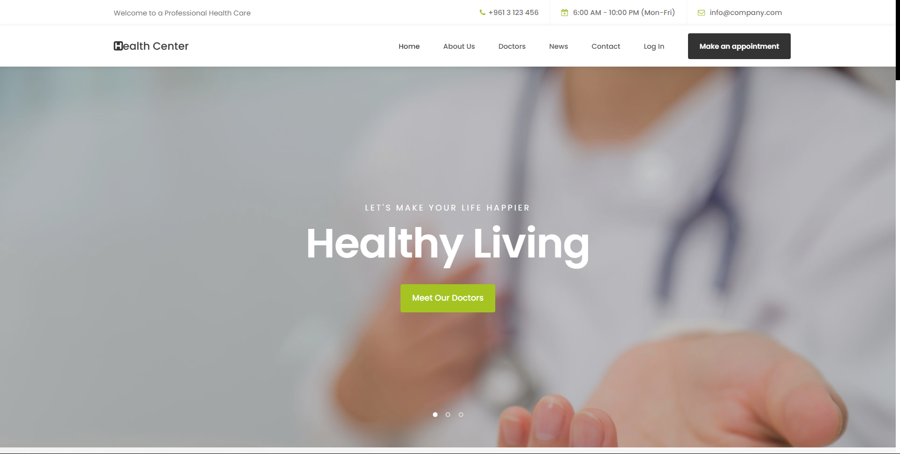
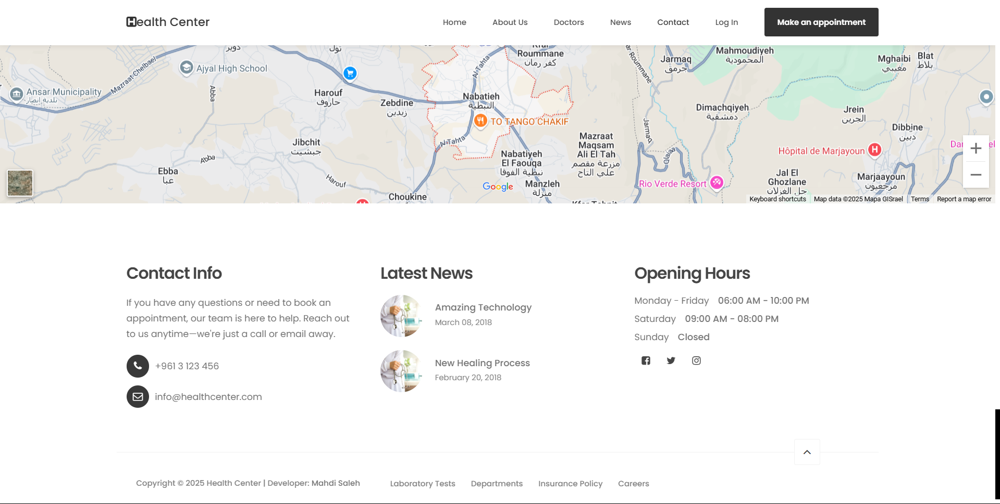
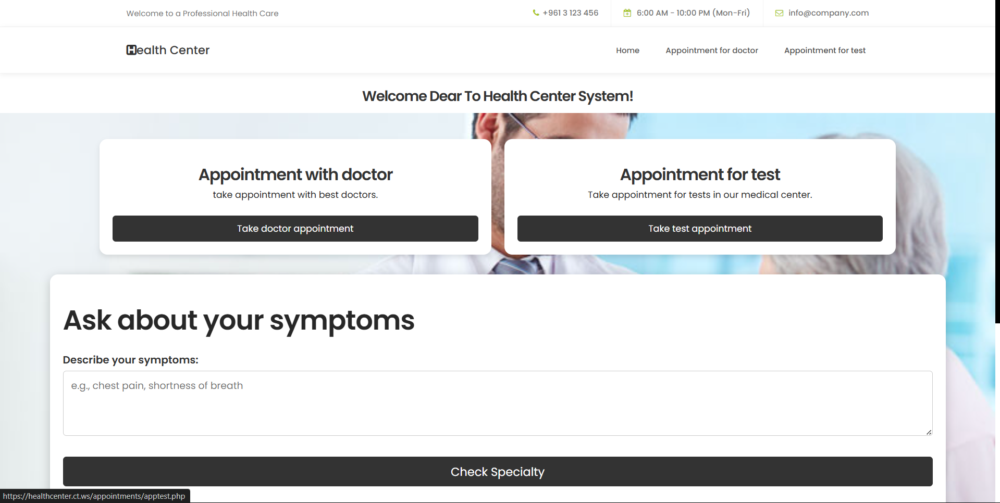

# Health_Center_System
This wesbite was my graduation project from the university. 

This system enables patients to register, choose doctors based on specific medical 
categories (e.g., pediatrics, gynecology), and schedule appointments online. 
Doctors can review patient history, request lab tests, and upload results with 
personalized comments. Laboratories can upload test findings directly into the 
system, making the process faster and more efficient.

The system is built from HTML, CSS, Js, Bootstrap, AJAX, PHP, MySQL.
In each folder, we have a README.md file, where we explained what the system can do and each role of users can take actions in this system. 

We have 4 registered users: patient, doctor, lab staff and admin.

What we do in this system?

* Reduces appointment delays by enabling category-based online booking.
  
* Allows doctors to request lab tests and review results in one place.
  
* Enables patients to access lab results and doctor feedback conveniently.
  
* Enhances record-keeping and reduces administrative workload.

* Allows patients to take prescriptions and results online without come to medical center.

* Check more benefits in each README.md file in folders.

Check the images below:

