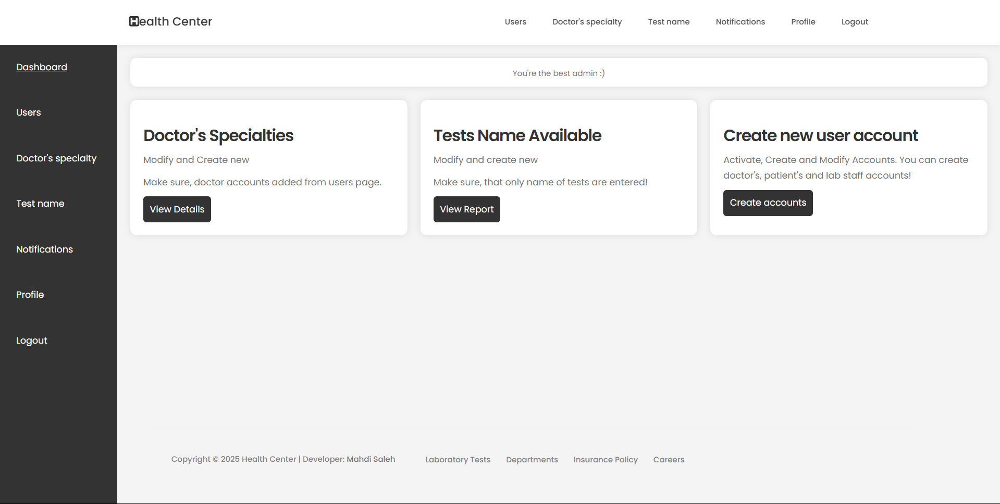

This is the admin side, the admin has limited access to the system. 
What can admin do? 

1- Add, Check, Active and deactive accounts for patients, lab staff and doctors; the admin only is responsible of creating doctors and labstaff accounts and assign their schedules on the system.

2- Create and modify specialties of doctors available in the medical center. Also the admin can add keywords for each specialy for filtration of patients.

3- Create and modify tests available in Lab of medical center; the admin add the name of tests and their amount.

4- Send and check for messages sent from lab staff and doctors. Also, when the admin enter into a message, directly the message will be marked as read. Then he can reply directly on the message. This message system is a buildin system on the website not a outside message system.

5- Check his profile and modify his personal information. (his personal informations aren't visible for anyone).
Check the image below, admin dashboard:

