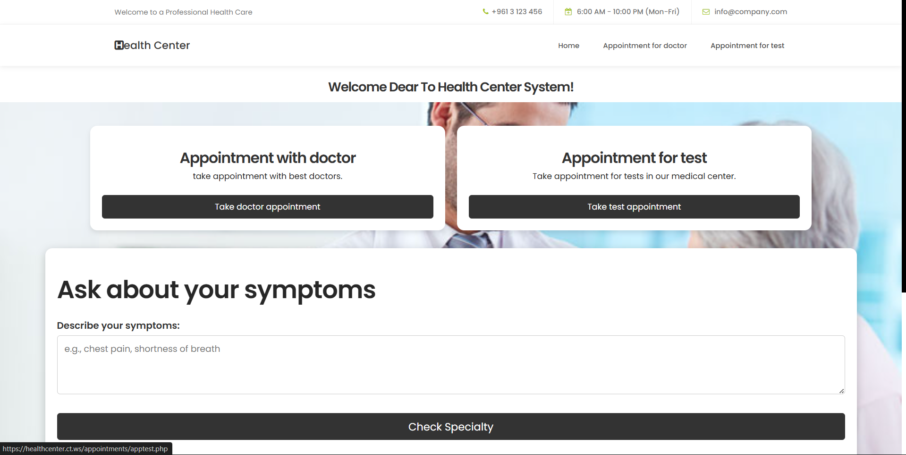
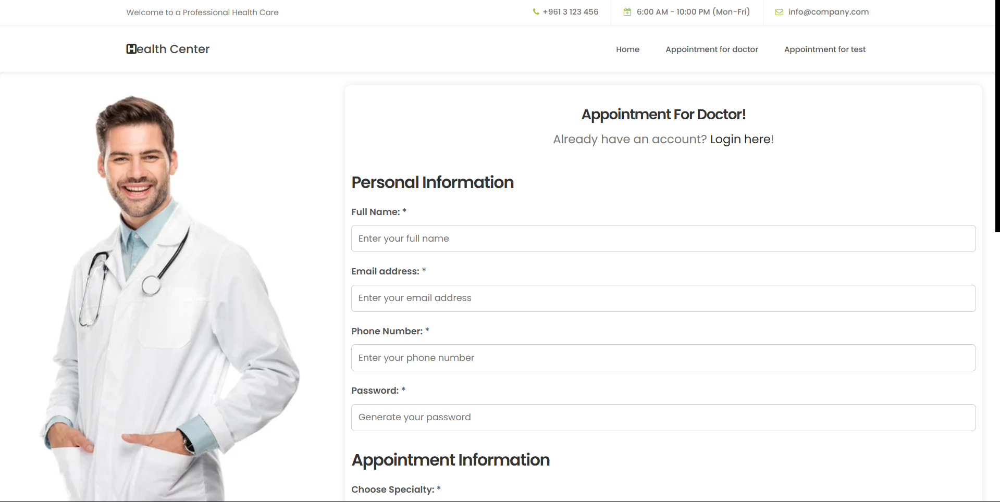
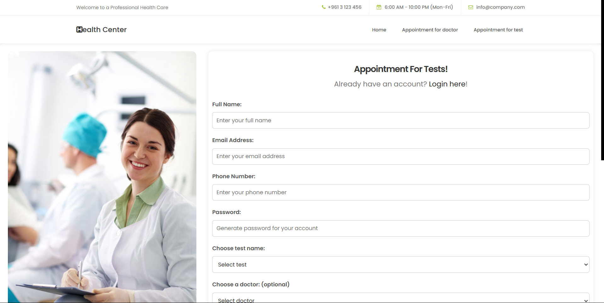

This folder is responsible of the online appointments taken by system from patients.

The patient will enter to the choose page, where he can choose if the appointment is for a doctor or a test lab; then, if the patient isn't sure about the specialty where a should search for doctors, he can ask the system about his symptoms and the system will tell him about the correct specialty.

How the symptoms checker work? 
-> The admin has entered a lot of keyword for every specialty created, then after the patient enter his symptoms, the system will directly search in the keywords lists of any copy or correspond words; then the system will return back the value of the speicalty name where the patient should search for a doctor to take an appointment.

When the user wants to take a appointment, if he already has an account he can easily login and his personal informations be replaced in each correspond inputs; and if he hasn't an account, when he enter his personal information and submit the form, the system will directly create a new account with his personal information.

For the doctor appointments: the patient should choose first the specialty of doctors, then choose from the doctors list (filtered as the specialty choosen). Then he can choose the date and time of the appointment as the registered schedule of the doctor choosen; by example: Dr Mahdi Saleh comes Monday from 8:00am till 11:00am, the patient should choose between 8 and 11 at Monday. 

For the Lab Test appointments: the patients should choose the test by name, then select it and choose a date and time between the time and days opening of the medical center. However, the patient can choose a doctor, to see his results and give his comments about it after they been uploaded on the system.

Check the images below:

