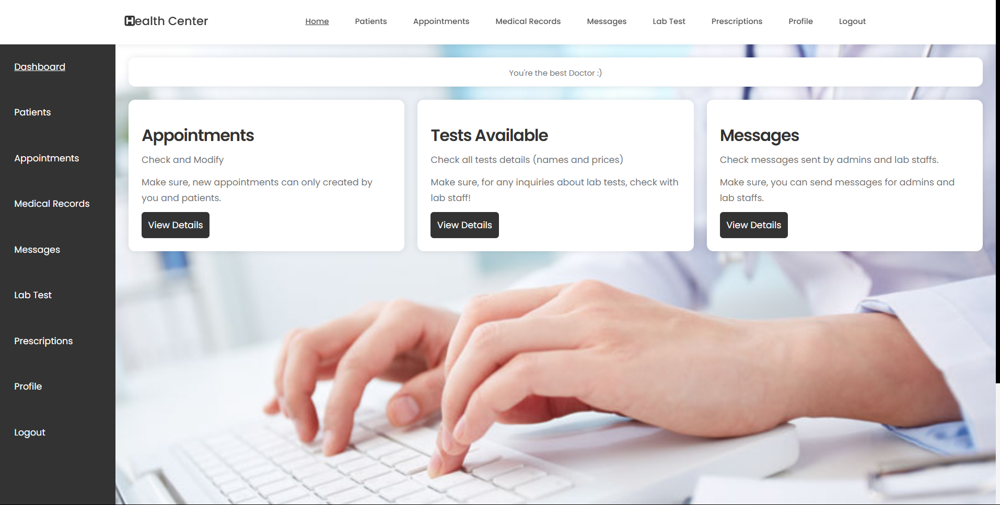

This is the folder of doctors. After login, if the role of the user is 'doctor' he will be redirected into this page.

What can doctor do? 

1- The doctor can check his patients list, this list has been filtered from appointments table where the patients choose this doctor (can be lab appointment or doctor).

2- The doctor can ADD and CHECK medical records about the patients. This medical records have status (visible or unvsible) for the patient.

3- The doctor can ADD and CHECK online prescriptions given by him to each patient. Each prescriptions have details like diagonsis, medications, instructions. This prescription can be modified by doctor and can be downloaded by the patient and buy his medicaments from the pharmacy.

4- He can check and modify the appointments list; the appointment status and schedule can be modified due an emergency out of medical center. After an update of the appointment, the patient should be alerted about this update and can check the new schedule for this appointment.

5- He can add payments for each appointment; if the patient pay or not for the appointment. This step is for management of the doctor payments only.

6- He can check the tests names and prices available in the Lab.

7- He can check the Lab Tests where he is mentioned in from the patient. After the result has been uploaded, the doctor can add his comments on the result.

8- He can send and check the messages received from lab staff and admins.

9- He can modify his personal information only; his schedule can be modified only by the admin.

Check the image of the dashboard below:

