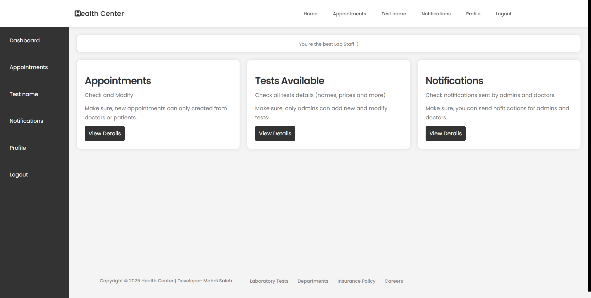

This is the folder of the lab staff. The lab staff user has a limited access to the system and has his own responsibilities on it.

What the Lab Staff can do? 

1- Check and modify the appointments shcedules taken by the patient for a test.
After the update, the patient should know about the updates taken and can check the new schedule of the appointment. 

2- Can add the payments for each appointment after beeing completed. 

3- After the lab test be completed, the lab staff can upload the result file when it's done for each test appointment; Where thi result will be visible for the patient and doctor if selected.

4- Can check for the tests names and prices available in the lab.

5- Check and send the messages from/to doctors/admin.

6- Check and modify his personal information in profile. Make sure that his working schedule can be modified ony by the admin.

Check the image below to see the Lab Satff Dashboard:

