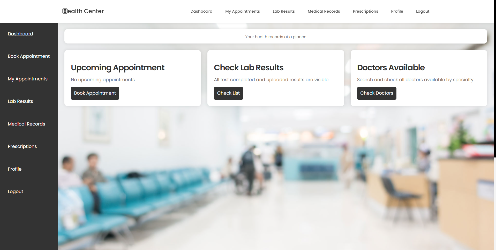

This is the folder of the patient. What can the patient do?

After the login process of the patient, he will be redirected to this page; where he can do:

1- Add, Check and modify his appointments list. He can search by doctors and lab appointments. The modify can be done only if the date is before the date of today or the status isn't completed.

2- Check the results uploaded of each lab test completed. If he selected a doctor, he can see the comment uploaded by doctor on his results. The result can be downloaded on his device.

3- Check the medical records added by doctors about him (where the status is visible).

4- Check and download the prescription given by doctor.

5- Update his secret personal information.

Check the image below:

